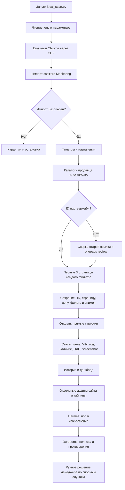

# A1 Monitoring — единое описание проекта

**Редакция:** 14 сентября 2026 года<br>
**Версия приложения:** 0.14.0<br>
**Основная папка:** `/Users/filaret/Desktop/Monitoring`<br>
**Основной host:** текущий MacBook (macOS, interactive Chrome); Windows/MSI — резервный handoff<br>
**Назначение:** локальный мониторинг размещения автомобилей компании A1 Auto на Auto.ru, Avito и сайте компании без API площадок.

> Документ объединяет описание продукта, текущего состояния, эксплуатационные сведения, архитектуру, ограничения и исходный код точки запуска. Это фактический срез проекта на указанную дату, а не обещание, что все площадки доступны в любой момент.

## 1. Назначение и границы

Система должна отвечать на четыре практических вопроса:

1. Какие объявления активных автомобилей из таблицы маркетинга должны быть опубликованы?
2. Есть ли конкретное объявление в кабинетах продавца и в публичной выдаче?
3. На какой странице из первых трёх страниц заданного фильтра оно обнаружено?
4. Работает ли прямая ссылка и соответствуют ли карточка, цена, год, VIN, наличие и НДС данным маркетинга?

Monitoring является зеркалом таблицы отдела маркетинга. Таблица маркетинга — основной бизнес-источник, но может обновляться с задержкой. Поэтому перед поиском выполняются импорт, защита от опасного изменения схемы и сверка кабинетов продавца:

- Auto.ru: каталог легковых автомобилей и каталог LCV;
- Avito: кабинет бренда A1 Auto;
- сайт A1Auto.ru: дополнительный источник для сверки активных предложений.

Для Auto.ru и Avito зафиксировано правило: **Москва, радиус 0 км**. Для новых автомобилей Auto.ru должна анализироваться выдача автомобилей общим списком, включая новый формат URL `new/group/...`, а не только сгруппированные комплектации.

VIN не является обязательным признаком. Maestra V800 и Mercedes VLE могут быть активными предложениями со статусом «в пути», хотя физического автомобиля и VIN ещё нет. В целевой модели автомобиль и объявление — разные сущности: перевыложенное объявление получает новый внешний ID, но сохраняет связь с внутренним автомобилем.

Система не обещает одинаковую выдачу для всех пользователей: результат относится к конкретному профилю браузера, времени, фильтру, географии, сортировке и глубине трёх страниц.

## 2. Текущее состояние

### Подтверждено на этом Mac

- Проект перенесён в `/Users/filaret/Desktop/Monitoring` без второй копии данных.
- Старый путь `/Users/filaret/Desktop/a1_search_monitor_noapi_product` остаётся compatibility symlink для исторических абсолютных путей; новые инструкции и команды используют только `/Users/filaret/Desktop/Monitoring`.
- Python импортирует приложение из новой папки.
- Docker-приложение и PostgreSQL отвечают на локальном `/api/v1/ready`.
- Исторический baseline из 244 офлайн-тестов, Ruff и Markdown-link check прошёл
  на Mac; актуальные stage/backup evidence ведутся отдельно в
  [STAGE_GATE_2026-09-14.md](production/STAGE_GATE_2026-09-14.md).
- Установлен офлайн-калькулятор стоимости LLM API; внешние API не подключены.

### Не принято как готовое

- Живой полный прогон обеих площадок после переноса.
- MacBook M7 acceptance: split-tunnel, контрольная выборка, roles и owner rollback decision.
- Живой GUI-trigger будущего MacBook LaunchAgent, если owner выберет расписание.
- Windows 11 на MSI как резервный handoff, если этот host когда-либо вернётся в scope.
- Безошибочная работа при CAPTCHA, 401/403/429 и изменении вёрстки площадок.
- Безопасная публикация полного отчёта на GitHub Pages.
- Полная целостность AI-пакета одного запуска.

Зелёные unit-тесты проверяют код и фикстуры, но не доказывают, что текущая выдача Auto.ru или Avito содержит ожидаемую машину.

## 3. Применяемый стек

| Слой | Технологии | Роль |
|---|---|---|
| Язык | Python 3.12 | Импорт, orchestration, парсеры, API и отчёты |
| Браузер | Google Chrome, Playwright, CDP | Видимый локальный обход площадок |
| Сервер | FastAPI, Uvicorn, Jinja2 | Локальный API и HTML-дашборд |
| Данные | PostgreSQL 16, SQLAlchemy, Alembic | Реестр автомобилей, наблюдения, история, обратная связь |
| Разбор HTML | BeautifulSoup, HTTPX | Извлечение карточек и диагностика страниц |
| Запуск | Docker Compose, shell, PowerShell | App, DB, backup и OS-обвязка |
| Контроль качества | pytest, Ruff | Unit/integration проверки и стиль |
| Локальный AI | Hermes, Ouroboros, llama.cpp, Qwen3.5-9B Q4_K_M, vision projector | Дополнительная проверка содержания и изображений |
| Документация | Markdown, Mermaid | Инструкции, карта алгоритма, аудит |

В основном окружении Docker volumes имеют имя Compose-проекта `a1_search_monitor_noapi`. `.env`, браузерный профиль, модели, снимки и рабочие JSON исключены из Git. База и backup находятся не в папке исходников.

## 4. Структура проекта

```text
Monitoring/
├── README.md, BIBLE.md, CONCEPT.md, INSTRUCTION.md
├── CHANGELOG.md
├── src/app/
│   ├── importer/       импорт и нормализация таблиц
│   ├── scraper/        Auto.ru, Avito, Chrome и прямые карточки
│   ├── service/        цикл, фильтры, сверка, аналитика, отчёты
│   ├── templates/      HTML дашборда
│   ├── api.py          HTTP-маршруты
│   ├── models.py       ORM-модели
│   └── schemas.py      контракты API
├── scripts/            точки запуска и AI-этапы
├── tools/              офлайн-проверки и расчёты
├── config/             AI-профили и тарифы
├── alembic/             история миграций
├── tests/               unit и integration тесты
├── docs/                эксплуатация, архитектура, аудит, финансы
├── artifacts/           приватные снимки и отчёты
├── docker-compose.yml
├── Dockerfile
├── pyproject.toml
└── requirements.lock
```

Главная точка запуска браузерного мониторинга — [scripts/local_scan.py](../scripts/local_scan.py). Полный канонический исходный код подключён именно этой ссылкой, чтобы приложение и документация не расходились при следующем изменении. Ниже приведён его публичный интерфейс и алгоритм.

## 5. Принцип работы по этапам



### Этап 1. Настройка

`local_scan.py` читает `.env`, включает `NETWORK_PROFILE=local_browser`, указывает локальный PostgreSQL, CDP-порт `19222`, видимый Chrome и каталог доказательств. Профиль `cautious` делает длинные паузы: 12–20 секунд между фильтрами и 6–12 секунд между страницами. Это снижает частоту обращений, но не гарантирует отсутствие CAPTCHA.

### Этап 2. Обновление источника

`MonitoringCycleService` импортирует CSV/экспорт Google Sheets, нормализует заголовки, проверяет дубли и резкое падение количества валидных строк. При подозрительном изменении прежний реестр сохраняется, а новый импорт переводится в ошибку/карантин.

### Этап 3. Сверка продавца

`SellerReconciliationService` получает каталоги Auto.ru cars, Auto.ru LCV и Avito, сопоставляет внешние ID, проверяет прямые ссылки и формирует кандидатов на перевыкладку. Автоматическая подмена ссылки не выполняется: неоднозначная связь требует проверки человека.

### Этап 4. Поисковая выдача

По каждому уникальному фильтру выполняется один поиск для всех связанных автомобилей. На каждой странице извлекаются объявления, идентификаторы, цена и позиция. Найденное объявление получает состояние `found` и номер страницы. Если выдача неполная, отсутствие не считается доказанным.

### Этап 5. Прямая карточка

Для ссылки сохраняются final URL, статус, причина снятия/продажи, цена, VIN, год, наличие, НДС и снимок viewport. Для Avito НДС читается из описания. Прямая карточка и позиция в поиске — независимые факты.

### Этап 6. Отчёт

Дашборд показывает машины, цены с разделением разрядов, ссылки площадок, номер страницы, историю наблюдений, снимки, ошибки, feedback менеджеров и статистику размещения.

### Этап 7. AI-контур

Hermes получает малое задание на одну машину/карточку и при необходимости изображение. Ouroboros проверяет полноту и противоречия подготовленного staged-отчёта. Они не являются независимыми браузерными наблюдателями, не обучаются автоматически на feedback и не должны менять реестр без решения человека.

## 6. Состояния и интерпретация

| Состояние | Значение |
|---|---|
| `found` | ID объявления найден в конкретном фильтре и на конкретной странице |
| `absent_uncertain` | В проверенном окне не найдено, но повторного подтверждения недостаточно |
| `absent_confirmed` | Повторные полные проверки не нашли ID в установленном окне |
| `technical_error` | CAPTCHA, HTTP-ошибка, тайм-аут или неизвестная структура |
| `filter_mismatch` | Фактическая страница не соответствует ожидаемому фильтру |
| `active` | Прямая карточка распознана как доступная |
| `sold/unpublished/closed` | На прямой странице найдено соответствующее состояние |
| `unknown/blocked` | Надёжной классификации нет или площадка заблокировала обращение |

`technical_error` никогда не должен превращаться в доказанный непоказ. День без запуска — это отсутствие измерения, а не подтверждённое отсутствие объявления.

## 7. Основные недостатки

### Критичные

- Общий статус может остаться зелёным при проблеме прямых карточек.
- AI-пакеты `latest` могут быть собраны от разных временных циклов.
- Отсутствующий снимок иногда уменьшает ожидаемое AI-покрытие вместо явного `missing_evidence`.
- Публикация агрегированной сводки защищена allowlist, но owner approval и
  реальная проверка итогового HTML ещё не выполнялись.

### Существенные

- Неполная выдача может потерять уже найденный положительный факт первой страницы.
- Положительный критерий «карточка активна» недостаточно строг при новой вёрстке.
- Аудиты сайта и головной таблицы имеют ограничения по страницам и объёму выборки.
- Плановый MacBook host-runner/LaunchAgent ещё не принят живым GUI-trigger: его
  mutex/recovery, один cycle и отсутствие автоматического retry должны быть
  подтверждены отдельно. Windows Task Scheduler остаётся непринятым fallback.
- Полный живой MacBook прогон с подтверждённым VPSUS split-tunnel не принят;
  Windows/MSI проверяется отдельно только при возврате в эксплуатационный scope.

## 8. Сильные стороны

- Используется видимый Chrome, а не только HTTP-запросы.
- Есть предварительная сверка кабинетов продавца и история смены URL.
- Сохраняются номер страницы, цена, фильтр, время и доказательства.
- Технические ошибки отделены от отсутствия объявления.
- Есть PostgreSQL, миграции, резервирование, дашборд и feedback.
- AI-задания можно дробить и выполнять последовательно.
- Структура уже пригодна для поэтапного улучшения без немедленного переписывания всего продукта.

## 9. Рекомендованный план развития

1. Разделить результат страницы и полноту всего фильтра: найденное сохранять даже при последующей ошибке.
2. Сделать отсутствие изображения явным техническим пропуском.
3. Добавить HTML-фикстуры CAPTCHA, снятой карточки, редиректа, пустой выдачи и нового формата Auto.ru.
4. Только после этого сравнить локальную модель с API на размеченной выборке.

Сделано в M1: импорт, seller catalogues, search, direct cards и производные
AI-артефакты связаны закрытым `cycle_id`; roster manifest пишется один раз, а
смешанные `latest`-файлы останавливают сборку пакета.

Сделано в M2: `Vehicle`, `Offer`, `SourceRecord` и исторические `OfferVehicleLink`
отделены от `Listing`; no-VIN записи не объединяются по похожим полям, а ручная
перевыкладка сохраняет старый offer и автора решения. Детали —
[Stable identity](production/STABLE_IDENTITY.md).

Сделано в M3: новые screenshots выдачи, точной карточки и direct-card получают
privacy-bounded hash manifest. Если screenshot не сохранён или layout не распознан,
сборщик не выдаёт бизнес-факт. Детали —
[Evidence contract](production/EVIDENCE_CONTRACT.md).

Сделано в M4: read-only очередь Offer объясняет расхождения цены/VIN/года, статус
НДС Avito, снятые/missing и ghost-публикации через факт, действие и evidence. Она
не меняет связь или статус автомобиля. Детали —
[Offer reconciliation](production/OFFER_RECONCILIATION.md).

Сделано в M5: серверные роли ограничивают lifecycle feedback и подтверждение
ссылок; ticket хранит связь с актуальным M4 finding, а отчёт по исключениям не
смешивает историю работы с фактом площадки. Детали —
[Operator release](production/OPERATOR_RELEASE.md).

Управляемый resume сознательно не включён: после сбоя создаётся новый ID, чтобы
система не дописывала поздние факты к закрытому roster. Эта функция относится к M6.

Полный вариант альтернатив, критерии переписывания и метрики находятся в [OPTIMIZATION.md](analysis/OPTIMIZATION.md). Вариант «с нуля» имеет смысл только после доказательства, что исправление текущего ядра дороже миграции всех накопленных правил и истории.

## 10. Установка и запуск

### Mac

```bash
cd /Users/filaret/Desktop/Monitoring
./scripts/run_monitoring_host_macos.sh --preflight
```

После Gate 0/1 M7 и явного owner approval один browser-only cycle:

```bash
./scripts/run_monitoring_host_macos.sh --engines auto_ru,avito --pages 3
```

Дашборд: http://127.0.0.1:18000/api/v1/dashboard<br>
JSON последнего поиска: http://127.0.0.1:18000/api/v1/status/scans/latest<br>
Прогресс: http://127.0.0.1:18000/api/v1/status/scans/progress

Расширенный инженерный запуск с аудитами и локальным AI — не M7 entrypoint и
только после успешного core-cycle:

```bash
./scripts/run_full_monitoring_macos.sh
```

### Windows 11 — резервный handoff

```powershell
Set-Location C:\work\A1_Monitoring
Set-ExecutionPolicy -Scope Process Bypass
.\scripts\setup_windows.ps1
.\scripts\start_windows.ps1 -OpenDashboard
.\scripts\local_scan_windows.ps1 -Engines auto_ru,avito -Pages 3 -Pace cautious
```

Полная инструкция находится в [ENVIRONMENT.md](operations/ENVIRONMENT.md). Это
не текущий production-путь: на Windows сначала нужен отдельный browser-only
acceptance, затем Hermes/Ouroboros и модель.

## 11. Тестирование и приёмка

```bash
cd /Users/filaret/Desktop/Monitoring
.venv312/bin/python -m pytest -q
.venv312/bin/python -m ruff check src tests scripts tools
.venv312/bin/python tools/check_documentation.py
git diff --check
```

Эти команды не проверяют живые площадки. Живая приёмка должна включать: найденную машину на странице 1, найденную на странице 2/3, машину вне первых трёх страниц, снятую карточку, перевыложенную ссылку, автомобиль без VIN, НДС в описании Avito и техническую CAPTCHA-ошибку.

Критерий готовности: все ожидаемые машины учтены; один `cycle_id` у всех материалов; технические сбои не стали отсутствием; у каждого вывода есть ссылка, время и доказательство; итог меняется на partial при ошибке любой обязательной стадии.

## 12. Стоимость перехода на API

Для 40 машин, 80 изображений и одного полного AI-цикла в день расчёт даёт ориентировочно:

| Вариант | Плановая стоимость за 30 дней |
|---|---:|
| Cloud.ru Qwen3.6-35B-A3B | 3 269,30 ₽ |
| Cloud.ru Kimi-K2.6 | 3 274,33 ₽ |
| OpenAI GPT-5.4 mini | $15,98 |
| Anthropic Claude Haiku 4.5 | $19,88 |

Это не фактический счёт: использованы оценки токенов, 25% запаса на повторы и 30 дней. API разгрузит локальную RAM, но не исправит ошибочную идентичность автомобилей, неполные evidence или CAPTCHA. Подробная формула и источники — [API_COSTS.md](finance/API_COSTS.md). Офлайн-калькулятор:

```bash
.venv312/bin/python tools/estimate_api_cost.py --vehicles 40 --images 80 --runs-per-day 1
```

## 13. Резервирование и безопасность

Не коммитить `.env`, cookies, Chrome profile, дампы, снимки, VIN-отчёты и AI HOME. Не выполнять `docker compose down -v` без подтверждённого backup. При возможном возврате на Windows нужен отдельный `pg_dump/pg_restore` и копия `artifacts`, а не простое копирование исходников.

Публичный GitHub может содержать код и безопасную документацию. Рабочий отчёт для
отдела продаж остаётся защищённым; `export_public_report.py` создаёт только
aggregate-only страницу после свежего owner allowlist. Реальная публикация и
проверка HTML остаются отдельным действием.

## 14. Источники внутри проекта

- [Рабочая инструкция](operations/OPERATOR.md)
- [Окружение и запуск](operations/ENVIRONMENT.md)
- [Алгоритм](architecture/ALGORITHM.md)
- [Аудит 14.09.2026](analysis/AUDIT_2026-09-14.md)
- [Варианты оптимизации](analysis/OPTIMIZATION.md)
- [Расходы API](finance/API_COSTS.md)
- [Исходник точки запуска](../scripts/local_scan.py)
- [Исходник coordinator](../src/app/service/cycle.py)

## Приложение A. Исходный код скрипта запуска мониторинга

Ниже приведён встроенный листинг рабочей точки запуска `scripts/local_scan.py` на дату редакции документа. Точная каноническая копия файла находится по ссылке [scripts/local_scan.py](../scripts/local_scan.py); при изменении скрипта сначала проверяется именно она, чтобы документация не стала источником другой версии.

```python
#!/usr/bin/env python3
from __future__ import annotations

import argparse
import asyncio
import json
import os
import shutil
import subprocess
import sys
import time
from dataclasses import asdict
from datetime import datetime, timedelta
from pathlib import Path
from urllib.parse import quote_plus, urlparse
from urllib.request import Request, urlopen

PROJECT_ROOT = Path(__file__).resolve().parents[1]
DEFAULT_PROFILE = PROJECT_ROOT / 'artifacts' / 'local_chrome_profile'
DEFAULT_EVIDENCE = PROJECT_ROOT / 'artifacts' / 'evidence'
PACING_PROFILES = {
    'normal': {
        'SCAN_FILTER_PAUSE_MIN_SECONDS': '2',
        'SCAN_FILTER_PAUSE_MAX_SECONDS': '5',
        'SCAN_PAGE_PAUSE_MIN_SECONDS': '1',
        'SCAN_PAGE_PAUSE_MAX_SECONDS': '3',
        'AUTO_RU_PAGE_DELAY_SECONDS': '2.5',
        'AVITO_PAGE_DELAY_SECONDS': '2.5',
        'TARGET_CLOSED_RETRY_SECONDS': '3',
    },
    'cautious': {
        'SCAN_FILTER_PAUSE_MIN_SECONDS': '12',
        'SCAN_FILTER_PAUSE_MAX_SECONDS': '20',
        'SCAN_PAGE_PAUSE_MIN_SECONDS': '6',
        'SCAN_PAGE_PAUSE_MAX_SECONDS': '12',
        'AUTO_RU_PAGE_DELAY_SECONDS': '5',
        'AVITO_PAGE_DELAY_SECONDS': '4',
        'TARGET_CLOSED_RETRY_SECONDS': '5',
    },
}


def _env_file_values(path: Path) -> dict[str, str]:
    values: dict[str, str] = {}
    if not path.exists():
        return values
    for raw_line in path.read_text(encoding='utf-8').splitlines():
        line = raw_line.strip()
        if not line or line.startswith('#') or '=' not in line:
            continue
        key, value = line.split('=', 1)
        values[key.strip()] = value.strip().strip('"').strip("'")
    return values


def _chrome_executable() -> str:
    candidates = [
        '/Applications/Google Chrome.app/Contents/MacOS/Google Chrome',
        '/Applications/Chromium.app/Contents/MacOS/Chromium',
    ]
    if sys.platform == 'win32':
        program_files = os.environ.get('ProgramFiles', r'C:\Program Files')
        program_files_x86 = os.environ.get('ProgramFiles(x86)', r'C:\Program Files (x86)')
        local_app_data = os.environ.get('LOCALAPPDATA', '')
        candidates = [
            str(Path(program_files) / 'Google/Chrome/Application/chrome.exe'),
            str(Path(program_files_x86) / 'Google/Chrome/Application/chrome.exe'),
            str(Path(local_app_data) / 'Google/Chrome/Application/chrome.exe') if local_app_data else '',
            str(Path(program_files) / 'Chromium/Application/chrome.exe'),
        ] + candidates
    for candidate in candidates:
        if candidate and Path(candidate).is_file():
            return candidate
    for name in ('google-chrome', 'google-chrome-stable', 'chrome', 'chromium', 'chromium-browser'):
        resolved = shutil.which(name)
        if resolved:
            return resolved
    raise RuntimeError('Google Chrome or Chromium was not found')


def _cdp_ready(url: str) -> bool:
    try:
        with urlopen(f'{url.rstrip("/")}/json/version', timeout=1) as response:
            return response.status == 200
    except OSError:
        return False


def _ensure_cdp_page(cdp_url: str) -> bool:
    """Chrome can keep its debug endpoint alive after its final tab was closed."""
    try:
        with urlopen(f'{cdp_url.rstrip("/")}/json/list', timeout=2) as response:
            targets = json.load(response)
        if any(item.get('type') == 'page' for item in targets):
            return False
        request = Request(f'{cdp_url.rstrip("/")}/json/new?about%3Ablank', method='PUT')
        with urlopen(request, timeout=2) as response:
            target = json.load(response)
        if target.get('type') != 'page':
            raise RuntimeError('Chrome did not create a controllable page')
        return True
    except (OSError, ValueError) as exc:
        raise RuntimeError(f'Cannot prepare a Chrome tab at {cdp_url}: {exc}') from exc


def _ensure_local_chrome(cdp_url: str, profile: Path) -> bool:
    if _cdp_ready(cdp_url):
        _ensure_cdp_page(cdp_url)
        return False
    parsed = urlparse(cdp_url)
    if parsed.hostname not in {'127.0.0.1', 'localhost'} or not parsed.port:
        raise RuntimeError('Local Chrome endpoint must use 127.0.0.1 or localhost with a port')
    profile.mkdir(parents=True, exist_ok=True)
    command = [
        _chrome_executable(), f'--remote-debugging-port={parsed.port}',
        '--remote-debugging-address=127.0.0.1', f'--user-data-dir={profile}',
        '--no-first-run', '--no-default-browser-check', 'about:blank',
    ]
    subprocess.Popen(command, stdout=subprocess.DEVNULL, stderr=subprocess.DEVNULL, start_new_session=True)
    for _ in range(30):
        if _cdp_ready(cdp_url):
            _ensure_cdp_page(cdp_url)
            return True
        time.sleep(1)
    raise RuntimeError('Local Chrome started but its control endpoint did not become ready')


def _configure_runtime(args: argparse.Namespace, env_values: dict[str, str]) -> str:
    cdp_url = f'http://127.0.0.1:{args.cdp_port}'
    evidence_dir = Path(args.evidence_dir).expanduser().resolve()
    evidence_dir.mkdir(parents=True, exist_ok=True)
    os.environ['NETWORK_PROFILE'] = 'local_browser'
    os.environ['BROWSER_CDP_URL'] = cdp_url
    os.environ['PLAYWRIGHT_HEADLESS'] = 'false'
    os.environ['SCAN_ENABLED_ENGINES'] = args.engines
    os.environ['SCAN_PAGES_LIMIT'] = str(args.pages)
    os.environ['EVIDENCE_DIR'] = str(evidence_dir)
    for key, value in PACING_PROFILES[args.pace].items():
        os.environ[key] = value
    if not args.probe_url:
        password = env_values.get('DB_PASSWORD')
        if not password:
            raise RuntimeError('DB_PASSWORD is missing in .env')
        port = env_values.get('DB_BIND_PORT', '5433')
        os.environ['DATABASE_DSN'] = (
            'postgresql+psycopg2://monitor:' f'{quote_plus(password)}@127.0.0.1:{port}/a1_search_monitor'
        )
    return cdp_url


async def _probe(url: str, pages: int) -> dict:
    host = (urlparse(url).hostname or '').lower()
    if host == 'avito.ru' or host.endswith('.avito.ru'):
        from app.scraper.avito import AvitoAdapter
        adapter = AvitoAdapter()
    elif host == 'auto.ru' or host.endswith('.auto.ru'):
        from app.scraper.auto_ru import AutoRuAdapter
        adapter = AutoRuAdapter()
    else:
        raise RuntimeError('Probe URL must belong to avito.ru or auto.ru')
    result = await adapter.scan_filter(url, max_pages=pages)
    payload = asdict(result)
    payload['scanned_at'] = result.scanned_at.isoformat()
    return payload


def _parser() -> argparse.ArgumentParser:
    parser = argparse.ArgumentParser(description='Run A1 monitoring through a persistent visible Chrome profile on this computer.')
    parser.add_argument('--engines', default='auto_ru,avito')
    parser.add_argument('--pages', type=int, default=3, choices=range(1, 11), metavar='1..10')
    parser.add_argument('--probe-url', help='Check one search URL without writing observations to the DB')
    parser.add_argument('--cdp-port', type=int, default=19222)
    parser.add_argument('--browser-profile', default=str(DEFAULT_PROFILE))
    parser.add_argument('--evidence-dir', default=str(DEFAULT_EVIDENCE))
    parser.add_argument('--pace', choices=tuple(PACING_PROFILES), default='cautious', help='Request pacing profile; cautious is slower and is the local default')
    parser.add_argument('--full-json', action='store_true', help='Print complete hit payloads')
    parser.add_argument('--watch', action='store_true', help='Keep running on this computer and repeat the full scan on schedule')
    parser.add_argument('--interval-minutes', type=int, default=None)
    return parser


def main() -> int:
    args = _parser().parse_args()
    env_values = _env_file_values(PROJECT_ROOT / '.env')
    cdp_url = _configure_runtime(args, env_values)
    if args.probe_url:
        started = _ensure_local_chrome(cdp_url, Path(args.browser_profile).expanduser().resolve())
        print('LOCAL_CHROME_STARTED' if started else 'LOCAL_CHROME_REUSED')
        print(f'LOCAL_SCAN_PACE {args.pace}')
        payload = asyncio.run(_probe(args.probe_url, args.pages))
        printable = payload if args.full_json else {
            'complete': payload['complete'], 'error': payload['error'],
            'pages_scanned': payload['page_count'], 'hits': len(payload['hits']),
            'diagnostics': payload['diagnostics'],
            'sample': [
                {'title': hit['title'], 'page': hit['page_number'], 'position': hit['position'],
                 'price': hit['price'], 'url': hit['url'].split('?', 1)[0]}
                for hit in payload['hits'][:10]
            ],
        }
        print(json.dumps(printable, ensure_ascii=False, indent=2))
        if payload['complete']:
            print(f'LOCAL_PROBE_OK pages={payload["page_count"]} hits={len(payload["hits"])}')
            return 0
        print(f'LOCAL_PROBE_BLOCKED error={payload["error"]}')
        return 2

    from app.db import get_db_context
    from app.service.cycle import MonitoringCycleService
    from app.service.scan_progress import ScanProgressTracker
    interval_minutes = args.interval_minutes or int(env_values.get('SCAN_INTERVAL_MINUTES', '360'))
    if interval_minutes < 1:
        raise RuntimeError('interval-minutes must be positive')
    exit_code = 0
    progress = ScanProgressTracker(str(Path(args.evidence_dir).expanduser().resolve()))

    def start_browser():
        started = _ensure_local_chrome(cdp_url, Path(args.browser_profile).expanduser().resolve())
        print('LOCAL_CHROME_STARTED' if started else 'LOCAL_CHROME_REUSED')
        print(f'LOCAL_SCAN_PACE {args.pace}')

    while True:
        with get_db_context() as db:
            try:
                result = MonitoringCycleService(db, progress_callback=progress, before_browser=start_browser).run()
            except Exception as exc:
                print(f'LOCAL_CYCLE_FAILED {type(exc).__name__}: {exc}', file=sys.stderr)
                return 1
        summary = result['scan']
        print('LOCAL_SELLER_PREFLIGHT ' + json.dumps(result['seller_preflight'], ensure_ascii=False))
        print('LOCAL_DIRECT_CARDS ' + json.dumps(result['direct_cards'], ensure_ascii=False))
        print(json.dumps(summary, ensure_ascii=False, indent=2))
        if summary['technical_errors'] or summary.get('links_need_review'):
            print(f'LOCAL_SCAN_PARTIAL technical_errors={summary["technical_errors"]} links_need_review={summary.get("links_need_review", 0)}')
            exit_code = 2
        else:
            print('LOCAL_SCAN_OK ' f'filters={summary["filters_scanned"]} found={summary["found"]} ' f'missed={summary["missed_confirmed"] + summary["missed_uncertain"]}')
            exit_code = 0
        if not args.watch:
            return exit_code
        next_run = datetime.now().astimezone() + timedelta(minutes=interval_minutes)
        print(f'LOCAL_MONITOR_WAIT next_run={next_run.isoformat(timespec="minutes")}')
        time.sleep(interval_minutes * 60)


if __name__ == '__main__':
    try:
        raise SystemExit(main())
    except KeyboardInterrupt:
        print('LOCAL_SCAN_INTERRUPTED', file=sys.stderr)
        raise SystemExit(130) from None
    except Exception as exc:
        print(f'LOCAL_SCAN_FAILED {type(exc).__name__}: {exc}', file=sys.stderr)
        raise SystemExit(1) from exc
```

В состав проекта также входит coordinator [src/app/service/cycle.py](../src/app/service/cycle.py), который выполняет полный цикл: импорт Monitoring → сверка кабинетов → поиск → прямые карточки. `local_scan.py` отвечает за CLI, видимый Chrome, pacing, прогресс и вызов coordinator; бизнес-логика намеренно находится в `src/app`, а не в одном монолитном файле.
