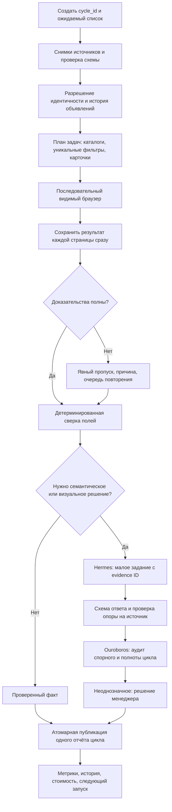

# Оптимизация и выбор дальнейшего подхода

## Рекомендация

Сохранить браузерный мониторинг и накопленные правила, постепенно заменить
файловую цепочку запускателей на единый управляемый цикл. LLM использовать для
неоднозначного содержания и изображений, а не для определения того, был ли
точный ID найден на странице. Переход на API можно выполнить независимо от
этого рефакторинга, но нельзя считать его исправлением качества входных данных.

Для текущего масштаба десятков автомобилей не нужны микросервисы, Kubernetes,
векторная база и несколько постоянно работающих агентов. Основная ценность —
верные данные, понятный оператору результат и продолжение после сбоя.

## Варианты

| Подход | Что сохраняем | Плюсы | Цена/ограничения |
| --- | --- | --- | --- |
| A. Укрепить текущий продукт — рекомендуется | БД, scraper adapters, фильтры, UI, историю | Быстрее исправить ключевые ошибки, меньше риск потерять бизнес-правила | Потребуется постепенно разделять крупные модули и wrappers |
| B. Новое ядро рядом, постепенное переключение | Старую историю и парсеры; заменяем coordinator/identity/AI contracts | Чистая модель данных, сравнение старого и нового на одних evidence | Переходный период с двумя реализациями; миграции и сравнение обязательны |
| C. Полная разработка с нуля | Только спецификацию, эталоны и извлечённые правила | Свобода выбрать простой desktop-first стек | Самая дорогая приёмка; CAPTCHA/вёрстка/география никуда не исчезнут |
| D. Только ручная/полуавтоматическая проверка | Кабинеты и таблицу | Минимальный технический риск, легко проверить спорные случаи | Трудозатраты и пропуски по выходным; нет стабильной истории без дисциплины |

A с переходом к B при необходимости — разумный маршрут. C имеет смысл, если
измеренная стоимость безопасных изменений старого ядра систематически выше
новой реализации и есть полный тестовый набор для сравнения. Сейчас таких
измерений нет; объявлять rewrite обязательным преждевременно.

## Предлагаемое ядро данных — ещё не реализовано

| Сущность | Смысл |
| --- | --- |
| Vehicle/Offer | Постоянный внутренний ID; VIN необязателен; планируемое предложение явно отмечено |
| SourceRecord | Строка маркетинга/Monitoring/сайта, её версия и время |
| Listing | Конкретный platform + external ID, первая/последняя встреча, прямой URL |
| VehicleListingLink | Датированная связь, метод/уверенность, подтверждение менеджера |
| FilterVersion | География, радиус, new/used, сортировка, параметры, версия |
| MonitoringCycle / Job | Ожидаемый roster, все этапы и статусы, retry/resume |
| PageObservation / CardObservation | Независимые факты поиска и прямой карточки |
| Evidence | Откуда, когда, final URL, image/text/hash, parser version |
| Finding / Feedback | Вывод, доказательства, решение человека, исправление |
| AIUsage | Модель, tokens, стоимость, задержка, лимит, результат валидации |

Некоторые аналоги уже есть в БД; это целевая нормализация, не предложение
удалить действующие таблицы. Перевыкладка создаёт новый Listing, но не новый
Vehicle. Цена маркетинга и цена площадки хранятся отдельно с временем.

## Карта целевого алгоритма

LLM не должна разрешать себе новые браузерные действия из текста объявления.
Если AI предлагает повторное открытие, coordinator проверяет допустимость,
источник, бюджет и состояние circuit breaker, затем создаёт отдельную задачу.

## Как снизить число запросов, не потеряв контроль

1. Обходить каждый уникальный фильтр один раз за цикл для всех его машин — это
   уже реализовано, сохранить.
2. Каталог продавца — один проверенный снимок на площадку/раздел за цикл.
   При неполноте не считать отсутствующие объявления снятыми.
3. Поиск и direct-card проверку разделить: проверка позиции нужна регулярно,
   полное повторное чтение описания — при изменении/истечении срока актуальности.
4. Кэшировать **анализ**, а не выдавать старое наблюдение за свежее: hash
   нормализованных значимых полей + image/perceptual hash + версия правил/модели.
5. AI повторяет только изменившиеся карточки, новые изображения, спорные факты
   и выборочную контрольную долю неизменившихся. Полный контроль по расписанию
   остаётся: кэш может не заметить содержательное изменение.
6. Вырезать для vision полезную область карточки; рядом давать извлечённые текст,
   цену и описание. Сохранять оригинальный снимок как доказательство.
7. Повторять только провалившийся этап. Не перезапускать 15 фильтров из-за одного
   некорректного JSON последнего агента.
8. Для площадок один поток на источник, ограниченное число попыток, штатная
   пауза/ручной gate при CAPTCHA. Более медленная загрузка не гарантирует
   отсутствие блокировок; ускорение через параллельные браузеры здесь не цель.

## Разделение Hermes и Ouroboros

| Роль | Вход | Выход | Чего не делать |
| --- | --- | --- | --- |
| Правила Python | Структурированные поля и баннеры | Факты, совпадения ID, цена/год/НДС | Не отправлять арифметику в LLM |
| Hermes | Одна машина/карточка/изображение + эталон | Расхождения и редакторские рекомендации с источниками | Не изменять реестр и не объявлять неопределённость фактом |
| Ouroboros | Manifest покрытия, findings и спорные evidence | Контроль пропусков/противоречий, план дополнительной проверки | Не повторять весь обход и все снимки без причины |
| Менеджер | Спорные связи и существенные расхождения | Подтверждённое решение | Не исправлять историю задним числом без события |
| Инженерный агент | Тестовый дефект и изолированная ветка | Предложение patch + тесты | Не менять работающий код во время мониторинга |

Название framework не гарантирует качество. В API-режиме можно оставить роли
Hermes/Ouroboros, но реализовать их через один тонкий model adapter. Сложный
tool-enabled агент нужен только для задач, действительно требующих инструментов.

«Обучение на ошибках» сначала организовать как versioned набор подтверждённых
примеров/правил и regression eval. Самообучение весов и неконтролируемая
самомодификация проекта не нужны для первого улучшения качества.

## План работ и критерии

Оценки ниже — предварительные инженерные часы, не рыночный прайс и не обещание
срока. Они не включают ожидание оператора, CAPTCHA и неизвестные изменения сайтов.

| Этап | Объём | Предварительная оценка | Gate |
| --- | --- | ---: | --- |
| 1. Честный цикл | P0 статусы, единый run manifest, roster, missing evidence, timeout/resume | 24–40 ч | Нельзя получить зелёный итог при провале обязательной стадии |
| 2. Устойчивая идентичность | stock/offer ID, история перепубликации, migration, ручное подтверждение | 24–48 ч | Две машины без VIN не сливаются; смена внешнего ID не теряет историю |
| 3. Качество parser/evidence | Page-level results, валидность direct-card, fixtures, явная полнота каталогов | 20–40 ч | Эталонная выборка и controlled live совпадают |
| 4. API-адаптер и оценка качества | Текст/vision, usage, лимиты, схемы, выборка эталонов | 24–44 ч | Проверенная стоимость и не хуже согласованного baseline |
| 5. Эксплуатация и доступ | Windows acceptance, отчёт по ролям, backup всего пакета, monitoring | 16–32 ч | Отчёт воспроизводим и безопасно доступен отделу продаж |

Этапы частично пересекаются; их нельзя механически суммировать в коммерческую
смету. Минимальная новая реализация аналогичного объёма с миграцией и приёмкой
ориентировочно потребует 160–280 ч; неопределённость выше, чем при этапах 1–3.

## Метрики эффективности

- Покрытие: проверенные ожидаемые объявления / все ожидаемые, отдельно по этапам.
- Свежесть: возраст данных таблицы, каталога, поиска, direct-card, AI отдельно.
- Точность: false found / false absence по ручной размеченной выборке.
- Перевыкладки: время от появления нового ID до подтверждённой связи.
- Качество контента: подтверждённые замечания / все AI-замечания; пропущенные ошибки.
- Эксплуатация: доля завершённых циклов, причины partial, p50/p95 длительности,
  RAM peak, длительность дефицита памяти, стоимость цикла и машины.
- Бизнес: время менеджера на разбор, срок исправления, повторяемость ошибки.

Выходные анализировать только по фактически проведённым проверкам. «Не было
наблюдения» нельзя интерполировать в «объявление отсутствовало весь день».

## Решение по стеку

На ближайший этап оставить Python/FastAPI/PostgreSQL/Chrome и модульный монолит.
Если эксплуатация навсегда ограничится одним ПК и Docker окажется основным
источником сложности, отдельно сравнить native service + SQLite/WAL с текущим
PostgreSQL. Это потребует пересмотра блокировок, миграций и backup; сейчас
автоматически заменять БД нельзя. Общий доступ нескольких менеджеров склоняет
в сторону PostgreSQL и защищённого серверного интерфейса.
