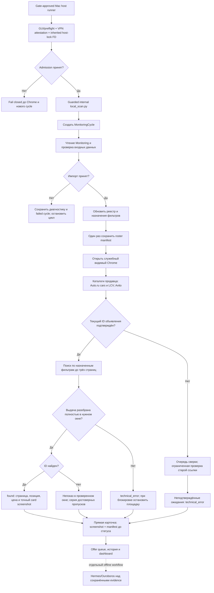

# Как работает мониторинг: фактический алгоритм

Срез исходников 14.09.2026, приложение 0.14.0. Карта описывает существующий код;
предлагаемая архитектура находится в [плане улучшений](../analysis/OPTIMIZATION.md).

## Карта текущего MacBook marketplace cycle

Поиск и прямые карточки теперь формируют единый итог цикла: ошибка, неразрешённая
ссылка или неполная карточка дают `partial`, а не `completed`. Аудиты сайта,
маркетинга и AI по-прежнему используют отдельные `latest`-артефакты; их привязка к
одному manifest остаётся открытой работой M1.

С 0.12 collector сохраняет PNG и companion hash manifest до бизнес-вывода. Если
снимок page/target card/direct card не записан, результат получает
`evidence_missing`; неизвестная layout не трактуется как empty. Контракт и границы
fixtures описаны в [Evidence contract](../production/EVIDENCE_CONTRACT.md).

С 0.13 очередь Offer сводит последнюю проверяемую прямую карточку и свежий
каталог продавца в action-oriented findings. Она не меняет реестр и не называет
статус Offer продажей автомобиля; правила — [Offer reconciliation](../production/OFFER_RECONCILIATION.md).

## 1. Подготовка

Только `scripts/run_monitoring_host_macos.sh` может начать marketplace cycle.
Он передаёт внутреннему `local_scan.py` `NETWORK_PROFILE=local_browser`, валидную
VPN attestation и проверяемый inherited Mac host-lock FD. Прямой `local_scan.py`,
его `--watch`, `make watch`, container и non-Mac process fail-closed; boolean
`LOCAL_BROWSER_HOST_ADMISSION` либо файл по отдельности недостаточны. Это
операционная защита от случайного entrypoint, не hostile-security proof против
того же локального пользователя. Chrome использует CDP на `127.0.0.1:19222` в
постоянном отдельном профиле.
Chrome запускается через CDP на `127.0.0.1:19222` в постоянном отдельном профиле.
Если endpoint уже доступен, используется существующий браузер; строгой проверки
владельца endpoint сейчас недостаточно.

В PostgreSQL есть advisory locks полного цикла, сканирования и discovery. Они
дополняют удерживаемый Mac host lock и защищают от части параллельных запусков.
AI выполняется только отдельно над сохранёнными evidence, не как marketplace cycle.

## 2. Обновление Monitoring

`CsvOrXlsxReader` получает источник, `SourceImporter` нормализует поля, проверяет
часть обязательных признаков и дубликаты VIN. Если количество годных строк резко
упало относительно предыдущего снимка или исчезли признаки автомобилей, импорт
помещается в карантин. Старый реестр сохраняется. Это полезная, но неполная защита
от изменения подрядчиком структуры таблицы.

Импорт создаёт отдельный `Vehicle` и `Offer`: единственный VIN fingerprint либо
уже связанный canonical ID объявления разрешает идентичность. Без таких якорей
создаётся новая provisional-запись; марка, модель, год и цена не склеивают машины.
Перевыкладка без VIN требует явного подтверждения оператора и сохраняет историю
старого Offer. Пустой статус в Monitoring тоже считается активным. Новые ссылки сверяются с
локально подтверждёнными override; история изменений URL сохраняется.

После импорта `FilterRegistryService` обновляет канонический каталог и назначения.
География Москва/0 км и правила new/list реализованы в фильтрах и парсерах,
но правильный URL сам по себе не доказывает правильную настройку видимой площадки.

## 3. Проверка кабинетов продавца

Используются два каталога Auto.ru и один Avito. По умолчанию до 5 страниц каталога.
Каталог считается полным только при доказанном конце; достижение лимита не означает,
что перечислены все автомобили. Найденные ID сохраняются как кандидаты.

Для каждой активной машины проверяются валидность прямого URL, уникальность связи
и присутствие текущего ID в свежем каталоге продавца. Если ID не найден, программа
предлагает похожие публикации того же семейства. Первые несколько старых ссылок
проверяются напрямую, по умолчанию не более 5 на площадку.

Только `verified`-связи допускаются к достоверному поиску. Это уменьшает ложные
непоказы по старым ссылкам, но может излишне уменьшить покрытие при неполном каталоге.

## 4. Поиск в выдаче

Сначала Auto.ru, затем Avito. Для каждого фильтра собирается набор ожидаемых ID.
Парсер открывает страницы до лимита, ждёт отрисовку, распознаёт основную выдачу,
исключает рекомендации и проверяет пагинацию. В режиме `cautious` выдерживаются
12–20 секунд перед фильтром и 6–12 перед страницей плюс ожидание отрисовки.

Совпадение производится по ID публикации, а не по внешнему виду или цене.
Один фильтр проверяется для всех относящихся к нему машин — отдельный поиск для
каждой машины не выполняется. Это сильная сторона текущего алгоритма.

Наблюдение сохраняет ID автомобиля, ID объявления, версию/URL фильтра, время,
страницу, место в странице, цену и диагностику. Нумерация страницы начинается с 1;
служебный ноль при отсутствии hit не является настоящей «нулевой страницей».

Если любая часть требуемого обхода неполна, текущий код записывает technical_error
для ожиданий фильтра; положительное попадание с предыдущей успешной страницы может
не попасть в итог как `found`. В улучшенной модели нужно сохранять положительный
факт отдельно от неполноты проверки остальных машин.

## 5. Учёт непоказов

Если выдача достоверно пройдена, но ID не найден, появляется `absent_uncertain`.
В продуктивном профиле после установленной серии (по умолчанию 2 запуска)
формируется `absent_confirmed` и эпизод отсутствия. Изменение ID или версии фильтра
разрывает сопоставимость серии. Техническая ошибка не добавляет подтверждения.

Это «не найден в первых трёх страницах в моменты проверок». Это не означает
«объявление нигде не существует» или «отсутствовало непрерывно все выходные».
Для дней без запусков значение должно трактоваться как «нет измерения».

## 6. Прямые карточки

После поиска открываются текущие валидные ссылки с учётом лимита и ранее возникших
блокировок. Уже проверенные при preflight карточки повторно не открываются.
Извлекаются заголовок, цена, VIN при наличии, год, признаки наличия, НДС и фрагмент
описания. Для Avito НДС читается из текста. Сохраняется viewport-снимок страницы.

| Код | Смысл |
| --- | --- |
| `active` | Страница распознана как открытая карточка; текущий критерий слишком слаб — может опираться только на заголовок |
| `sold` / `unpublished` / `closed` | Распознан баннер продажи, снятия или закрытия |
| `redirected` | Прямой URL привёл к другому ID или странице |
| `http_error` | Неуспешный HTTP, сам по себе не доказывает продажу |
| `unknown` / `ambiguous_status_text` | Недостаточно надёжных признаков |
| `blocked` / `skipped_after_block` | Защита площадки или пропуск после неё |
| `missing_link` / `limit_reached` | Нет адреса либо исчерпан лимит проверки |

Снимок фиксирует видимое состояние, но не все фото и не всё описание. Детерминированный
анализ может использовать больше текста, чем видно в viewport. Это необходимо
показывать в происхождении замечаний.

## 7. Сверки маркетинга и A1Auto

Отдельные команды читают головную таблицу и публичный каталог сайта. Головная
таблица связывается с Monitoring по VIN или ID ссылок. Сравниваются активность,
цены, год, НДС, текущие адреса и данные сохранённых карточек. Активные несвязанные
строки показываются отдельно в отчёте отдела продаж.

Сайт сейчас читается как одна HTML-страница каталога; полнота пагинации не доказывается.
Таблица маркетинга читается повторно разными аудитами: возможны разные снимки
одного полного запуска. Это нужно заменить единым снимком входов на `cycle_id`.

## 8. AI-этапы

`build_live_agent_packet.py` принимает явный завершённый `cycle_id`, получает только
его search runs и требует head-table/site artifacts с таким же ID. `latest.json`
служит лишь файлом-указателем и не может смешивать циклы. `build_ai_work_units.py` формирует один пакет на машину
и задания для существующих файлов снимков. Отсутствующие изображения сейчас
отбрасываются до формирования знаменателя покрытия — опасное ограничение.

Hermes получает текст одного автомобиля, затем каждый снимок отдельно. По умолчанию
малые сверки идут без reasoning, итоговое ранжирование — с `low`. Один запрос за раз,
до 3 замечаний на малое задание, до 5 в итоговой выжимке. Подробные замечания остаются
в `unit_reports`; короткий итог не является полным списком всех проблем.

`validate_staged_review.py` сверяет JSON и соответствие итоговых замечаний ранее
полученным findings. Это проверка происхождения между AI-ответами; она не доказывает,
что текст findings действительно совпадает с исходным DOM или пикселями.

Ouroboros читает staged-отчёт и оценивает покрытие/противоречия. В обоих агентах
используется одна Qwen-модель. Это два разных задания, а не две независимые модели.
Автоматического обучения на замечаниях менеджеров, изменения кода и выкладки нет.

## 9. Отчёт и ресурсы

FastAPI/Jinja2 строит HTML по PostgreSQL и сохранённым аудитам. История и обратная
связь хранятся в базе, AI-ответы пока преимущественно в файлах, без полноценного
единого жизненного цикла в дашборде.

На Mac полный сценарий оставляет браузер и контейнеры при старте LLM. На Windows
предусмотрена их остановка и порог свободной RAM 7500 МБ; Docker Desktop/WSL при этом
может удерживать память. Этот порог — предварительное условие, а не гарантия
достаточности RAM на всём этапе. Паузы ограничивают среднюю нагрузку, но сами веса
модели и KV-cache остаются в памяти.
