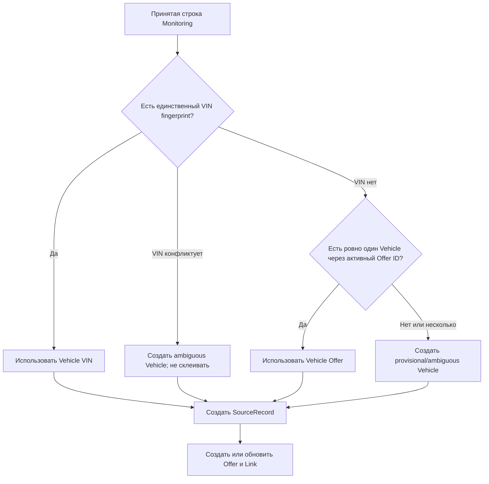

# M2: устойчивая идентичность Vehicle / Offer

Статус: реализовано в коде `0.11.0`; live acceptance площадок и массовая ручная
проверка существующего реестра не выполнялись. Этот документ фиксирует фактическую
модель, границы её автоматизации и процедуру оператора.

## Зачем это нужно

Ранее импорт использовал хеш VIN, а при его отсутствии — комбинацию марки, модели,
поколения и года. Второй вариант не является идентификатором автомобиля: два
одинаковых автомобиля могли оказаться одной строкой реестра. M2 запрещает такое
слияние. Совпадение цены, названия, года или текста заметки не даёт права связать
два автомобиля.

## Сущности и неизменяемые границы

| Сущность | Смысл | Что не делает |
| --- | --- | --- |
| `Vehicle` | Внутренний ID автомобиля/планируемого автомобиля | Не объединяется по сходству полей |
| `Offer` | Одна площадка + один canonical external ID | Не утверждает, чей это автомобиль |
| `OfferVehicleLink` | Датированное утверждение связи `Vehicle` ↔ `Offer` | Не удаляет старую связь и не переписывает наблюдения |
| `SourceRecord` | Принятая строка конкретного `SourceImportSnapshot`: номер, hashes, ключи offer и метод разрешения | Не хранит вторую сырую копию всей таблицы |
| `Listing` | Совместимая проекция для текущего мониторинга и старой истории | Не является более первичным ID машины |

Существующие `ListingObservation`, `AbsenceEpisode`, `ListingReconciliation`,
feedback и события реестра продолжают ссылаться на прежний `listing_id`.
Миграция создаёт отдельный `Vehicle` для каждого исторического `Listing` и не
переписывает эту историю.

## Правило разрешения строки импорта



`VIN fingerprint` — SHA-256 нормализованного VIN; в таблице M2 не нужен второй
открытый VIN. External ID берётся только из проверенного URL Auto.ru/Avito через
`canonical_listing_key`; tracking-параметры и изменение slug не создают новый
`Offer`.

Неоднозначность остаётся видимой в `SourceRecord.resolution`:
`vin_ambiguous`, `offer_ambiguous`, `new_unanchored` либо `vin_new` / `vin_match` /
`offer_match`. Она не понижается до «того же автомобиля» автоматически.

## Перевыкладка без VIN: только подтверждение оператора

Если у автомобиля без VIN исчез старый external ID и появился новый, импорт создаёт
новый provisional `Vehicle` и candidate-link. Это намеренно: внешне похожая строка
не доказывает перевыкладку.

Оператор подтверждает связь через существующий защищённый маршрут:

```text
PATCH /api/v1/listings/{listing_id}/links
```

Требуются допустимый URL площадки, `actor` и осмысленный `reason`. После этого
`ListingRegistryService` вызывает `IdentityService.confirm_republication`:

1. предыдущий активный link этого `Vehicle` и источника получает `superseded`;
2. новый `OfferVehicleLink` записывается как `confirmed`, method
   `operator_confirmed`, с человеком и причиной;
3. candidate-link того же `Offer`, принадлежавший другому provisional Vehicle,
   получает `rejected` — но тот `Vehicle`, его `Listing` и наблюдения не удаляются.

Таким образом, подтверждение переносит **связь Offer**, а не «сливает» записи
автомобилей. Оператор отдельно решает, как обработать возникшую дублирующую
проекцию реестра; M2 не деактивирует её скрытно.

## Состояния `OfferVehicleLink`

| Состояние | Значение | Может назначить |
| --- | --- | --- |
| `candidate` | Импорт/legacy создаёт проверяемую гипотезу | Система |
| `confirmed` | Связь доказана VIN или явным операторским решением | Система для единственного VIN; оператор для перевыкладки |
| `superseded` | Предыдущее размещение заменено более поздним у того же Vehicle | Операторская процедура |
| `rejected` | Operator отклонил конкурирующую candidate-связь | Операторская процедура |

Импорт никогда не переводит активный Offer от одного Vehicle к другому. Конфликт
двух candidate/confirmed связей делает последующее разрешение неоднозначным.

## Миграция и откат

`20260914_0008_stable_identity` добавляет новые таблицы и `listings.vehicle_id`,
после чего backfill создаёт один `Vehicle` на прежний `Listing` и candidate-link
для каждой валидной старой прямой ссылки. Она append-only: Alembic downgrade
намеренно отклонён. Для возврата используется предварительно проверенный backup,
а не удаление новой истории.

Проверки M2 покрывают чистую и наследуемую схему, две одинаковые no-VIN машины с
разными Offer ID, повторный импорт и ручное подтверждение перевыкладки. Они не
доказывают работу текущей вёрстки, CAPTCHA или доступность Auto.ru/Avito.
